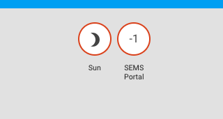
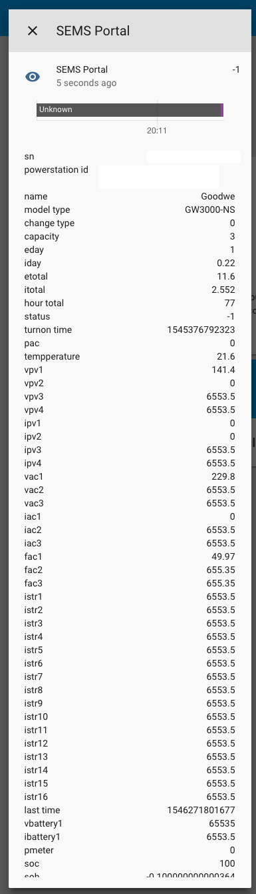

# Goodwe SEMS scraper for Home Assistant

## Setup

Crude sensor for Home Assistant that scrapes from GoodWe SEMS portal. Copy all the files in `custom_components/sems/` in your Home Assistant config dir:
- `sensor.py`
- `__init__.py`
- `manifest.json`

And update configuration. The ID of your Power Station can be retrieved by logging in to the SEMS Portal with your credentials:
https://www.semsportal.com

After login you'll see the ID in your URL. E.g.:
https://www.semsportal.com/powerstation/powerstatussnmin/12345678-1234-1234-1234-123456789012

In this example the ID of the Power Station is: 12345678-1234-1234-1234-123456789012

Example entry in `configuration.yaml`:

```
sensor:
  - platform: sems
    username: 'XXXX'
    password: 'XXXX'
    station_id : '12345678-1234-1234-1234-123456789012'
    scan_interval: 60

# Optional/example
# A template to ease access to the data as "sensor.pv_outputpower" etc.
  - platform: template
    sensors:
      pv_outputpower:
        value_template: '{{ states.sensor.sems_portal.attributes.outputpower }}'
        unit_of_measurement: 'W'
        friendly_name: "Power output"

```

Use the credentials you use to login to https://www.semsportal.com/. 

`scan_interval` controls how often the sensor updates/scrapes. By default this seems to be every 60 seconds.

## HACS

Note: The repository folder structure is changed in order to be compatible with [HACS](https://custom-components.github.io/hacs/), see [here](https://custom-components.github.io/hacs/#add-custom-repos ) how to add this as custom repo to HACS.
It is also [under submission](https://github.com/custom-components/hacs/pull/111) to be included by default in HACS.

## Screenies





## Credits

Reuses code from https://github.com/Sprk-nl/goodwe_sems_portal_scraper.
