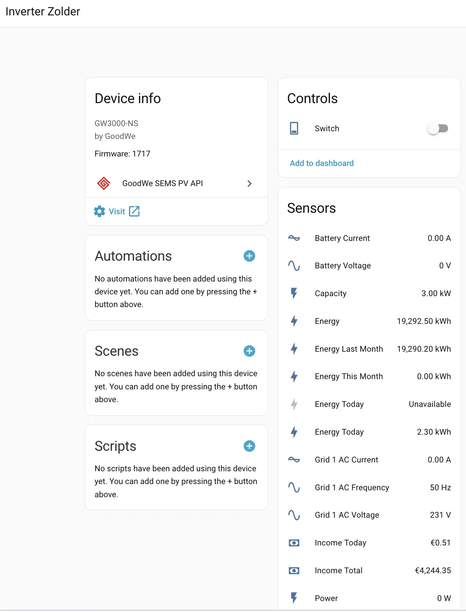
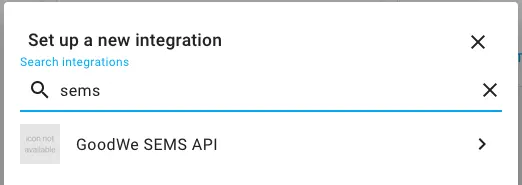
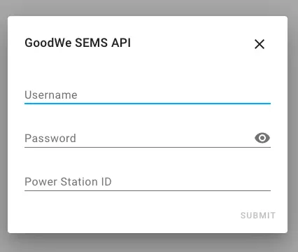

# GoodWe SEMS API integration for Home Assistant

[![Paypal-shield]](https://paypal.me/timsoethout)
<a href="https://www.buymeacoffee.com/TimSoethout" target="_blank"></a>
<a href="https://github.com/sponsors/timsoethout"></a>

Integration for Home Assistant that retrieves PV data from the GoodWe SEMS and
SEMS+ APIs.

The integration uses the SEMS+ Web API for inverter discovery, live telemetry,
and energy counters. It falls back to the legacy SEMS monitor API when that
endpoint provides usable data. If the legacy response is empty, the SEMS+ Web
API is used automatically.


[](https://tooomm.github.io/github-release-stats/?username=TimSoethout&repository=goodwe-sems-home-assistant)
[](https://tooomm.github.io/github-release-stats/?username=TimSoethout&repository=goodwe-sems-home-assistant)
[](https://analytics.home-assistant.io/)

## Setup

### Easiest install method via HACS

[](https://github.com/custom-components/hacs)

The repository folder structure is compatible with [HACS](https://hacs.xyz) and is included by default in HACS.

Install HACS via: https://hacs.xyz/docs/installation/manual.
Then search for "SEMS" in the Integrations tab (under Community). Click
`HACS` > `Integrations` > `Explore and Download Repositories`, search for
`SEMS`, select the result, and click `Download`.

### Manual Setup

Copy all files in `custom_components/sems/` to `custom_components/sems/` in
your Home Assistant configuration directory.

## Configure integration

In the Home Assistant UI, go to `Settings` > `Devices & services`, click `Add
Integration`, and search for `GoodWe SEMS API`.

Log in with your GoodWe SEMS or SEMS+ credentials. The integration discovers
the available power stations and creates an entry for each station.

The integration creates inverter sensors for status, power, capacity,
temperature, energy counters, PV strings, and grid measurements when those
values are supplied by SEMS. Battery entities are created when battery devices
and their supported functions are reported by the API.

Some live values can be `unknown` or `unavailable` when an inverter is
waiting, offline, or not producing. SEMS+ may omit live telemetry in that
state while still returning historical energy counters. The integration does
not replace missing values with zero.

### Optional: control the inverter power output via the "switch" entity

It is possible to temporarily pause energy production using the inverter's
`downtime` functionality. This is exposed as a switch and can be used in your
own automations.

This uses an undocumented API and can take a few minutes for the inverter to
pick up the change. It takes approximately 60 seconds to start again when the
inverter is in downtime mode.

### Recommended: use visitor account if you do not need to control the inverter

In case you are only reading the inverter stats, you can use a Visitor (read-only) account.

Create via the official app, or via the web portal:
Login to www.semsportal.com, go to https://semsportal.com/powerstation/stationInfonew. Create a new visitor account.
Login to the visitor account once to accept the EULA. Now you should be able to use it in this component.

## Screenies







## Debug info

Enable debugging in the Home Assistant UI by opening the SEMS integration and
selecting `Enable debug logging` from the menu. You can also enable it
explicitly in `configuration.yaml` as shown below. See the [Home Assistant
debug logging documentation](https://www.home-assistant.io/docs/configuration/troubleshooting/#enabling-debug-logging)
for more information.

Or add the last line in `configuration.yaml` in the relevant part of `logger`:

```yaml
logger:
  default: info
  logs:
    custom_components.sems: debug
```

Then share the relevant log lines.
See https://www.home-assistant.io/integrations/system_log/ and https://my.home-assistant.io/redirect/logs .
Click `...` > `Show full logs`.

SEMS+ Web response data is included in debug logs in redacted form to help
diagnose unsupported device types and missing fields. Remove any remaining
station details or personal information before sharing logs.

## Notes

* Sometimes the SEMS API is a bit slow, so time-out messages may occur in the log as `[ERROR]`. The component should continue to work normally and try fetch again the next minute.

## Development setup

- Setup HA development environment using https://developers.home-assistant.io/docs/development_environment
- clone this repo in config directory:
  - `cd core/config`
  - `git clone git@github.com:TimSoethout/goodwe-sems-home-assistant.git`
- go to terminal in remote VSCode environment
- `cd core/config/custom_components`
- `ln -s ../goodwe-sems-home-assistant/custom_components/sems sems`

## Linting

Run the same lint checks as the CI workflow:

```bash
ruff check custom_components/
ruff format --check custom_components/
mypy custom_components/ --ignore-missing-imports --python-version 3.13
```

To fix lint issues locally:

```bash
ruff check --fix custom_components/
ruff format custom_components/
```

## Credits

Inspired by https://github.com/Sprk-nl/goodwe_sems_portal_scraper and https://github.com/bouwew/sems2mqtt .
Also supported by generous contributions by various helpful community members.

[Paypal-shield]: https://img.shields.io/badge/donate-paypal-blue.svg?style=flat-square&colorA=273133&colorB=b008bb "Paypal"
