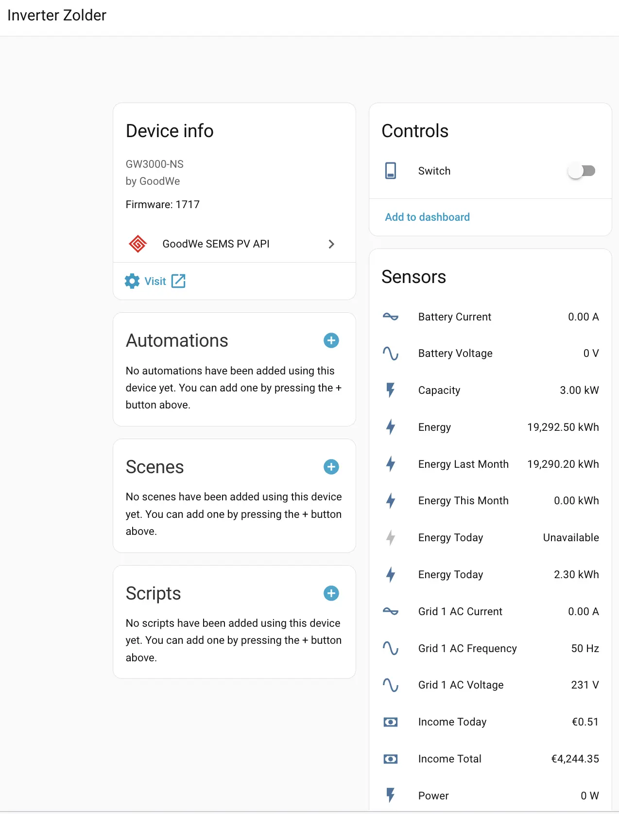
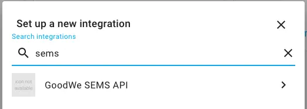
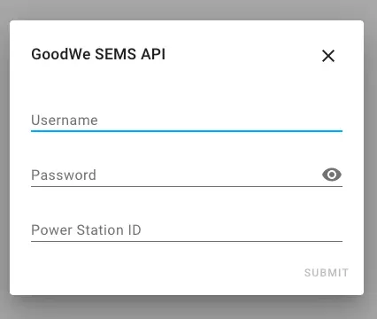

# GoodWe SEMS API integration for Home Assistant

[![Paypal-shield]](https://paypal.me/timsoethout)
<a href="https://www.buymeacoffee.com/TimSoethout" target="_blank"></a>
<a href="https://github.com/sponsors/timsoethout"></a>

Integration for Home Assistant that retrieves PV data from the GoodWe SEMS and
SEMS+ APIs.

The integration uses the SEMS+ Web API for station and device discovery, live
telemetry, and energy counters. The legacy monitor endpoint is not used in the
live data path. Legacy authentication and control remain compatibility
fallbacks for accounts and devices that need them. See the
[architecture plan](./ARCHITECTURE_PLAN.md) for the data flow and
[follow-up work](./TODO.md) for known coverage gaps.


[](https://tooomm.github.io/github-release-stats/?username=TimSoethout&repository=goodwe-sems-home-assistant)
[](https://tooomm.github.io/github-release-stats/?username=TimSoethout&repository=goodwe-sems-home-assistant)
[](https://analytics.home-assistant.io/)

## Setup

### Easiest install method via HACS

[](https://my.home-assistant.io/redirect/hacs_repository/?owner=TimSoethout&repository=goodwe-sems-home-assistant&category=integration)

Select the button to open this integration in HACS. HACS must already be
installed in your Home Assistant instance.

If the button does not open HACS, go to `HACS` > `Integrations` >
`Explore and Download Repositories`, search for `SEMS`, select the integration,
and click `Download`. For HACS installation instructions, see
https://hacs.xyz/docs/installation/manual.

### Manual Setup

Copy all files in `custom_components/sems/` to `custom_components/sems/` in
your Home Assistant configuration directory.

## Configure integration

In the Home Assistant UI, go to `Settings` > `Devices & services`, click `Add
Integration`, and search for `GoodWe SEMS API`.

Log in with your GoodWe SEMS or SEMS+ credentials. The integration discovers
the available power stations and creates an entry for each station.

The integration creates inverter sensors for status, power, capacity,
temperature, energy counters, PV strings, and grid measurements when those
values are supplied by SEMS. Battery entities are created when battery devices
and their supported functions are reported by the API.

Some live values can be `unknown` or `unavailable` when an inverter is
waiting, offline, or not producing. SEMS+ may omit live telemetry in that
state while still returning historical energy counters. The integration does
not replace missing values with zero.

### Update interval and password changes

SEMS is polled every 60 seconds by default. To change this, open the
integration under `Settings` > `Devices & services` and click `Configure`.
The interval must be between 60 and 3600 seconds; SEMS+ reports station data
once per minute, so polling faster only repeats data. All stations of one
account share one SEMS session, so the interval applies to every station of
that account. Each update makes several requests per station: with many
stations on one account (for example an installer account), a longer interval
lowers the risk of SEMS rate limiting. The change takes effect without a
restart.

When the account password changes, Home Assistant shows a re-authentication
notification after SEMS rejects the old password. Enter the new password once;
it is stored for all stations of that account.

### Optional: control the inverter power output via the "Inverter Control" switch

It is possible to temporarily pause and resume energy production using the
inverter's `downtime` functionality. This is exposed as the **Inverter
Control** switch and can be used in your own automations.

The switch uses the SEMS+ Web control API when the configured account has
remote-control permission. The legacy control API is used as a fallback when
the Web API is unavailable or rejects the operation. A read-only Visitor
account can continue to provide monitoring data, but cannot be expected to
control the inverter.

These are undocumented APIs, and the inverter can take a few minutes to pick
up a change. It takes approximately 60 seconds to start again when the
inverter is in downtime mode. If both control APIs fail, Home Assistant
reports the inverter name, serial number, and station in the service error.
Re-register the integration with the GoodWe account that has remote-control
permission.

### Recommended: use visitor account if you do not need to control the inverter

In case you are only reading the inverter stats, you can use a Visitor (read-only) account.

Create via the official app, or via the web portal:
Login to www.semsportal.com, go to https://semsportal.com/powerstation/stationInfonew. Create a new visitor account.
Login to the visitor account once to accept the EULA. Now you should be able to use it in this component.

## Screenies







## Debug info

Enable debugging in the Home Assistant UI by opening the SEMS integration and
selecting `Enable debug logging` from the menu. You can also enable it
explicitly in `configuration.yaml` as shown below. See the [Home Assistant
debug logging documentation](https://www.home-assistant.io/docs/configuration/troubleshooting/#enabling-debug-logging)
for more information.

Or add the last line in `configuration.yaml` in the relevant part of `logger`:

```yaml
logger:
  default: info
  logs:
    custom_components.sems: debug
```

Then share the relevant log lines.
See https://www.home-assistant.io/integrations/system_log/ and https://my.home-assistant.io/redirect/logs .
Click `...` > `Show full logs`.

SEMS+ Web response data is included in debug logs in redacted form to help
diagnose unsupported device types and missing fields. Remove any remaining
station details or personal information before sharing logs.

## Notes

* Sometimes the SEMS API is a bit slow, so time-out messages may occur in the log as `[ERROR]`. The component should continue to work normally and try fetch again the next minute.

## Development setup

Open this repository in VS Code with the Dev Containers extension and choose
**Reopen in Container**. The container automatically:

- Installs the test and lint dependencies.
- Installs the RTK CLI devcontainer feature.
- Clones Home Assistant Core into the workspace's `.ha-core` directory.
- Runs the Home Assistant development setup.
- Links this integration into `.ha-core/config/custom_components/sems`.
- Enables SEMS debug logging in `.ha-core/config/configuration.yaml`.
- Installs HACS if it is not already installed.
- Starts Home Assistant at http://localhost:8123.

On a fresh Home Assistant config, the first start creates a disposable owner
account and completes the onboarding wizard. The generated password is stored
in `.ha-core/.dev-owner-credentials.json` with owner-only file permissions.
Read that file to log in to the local instance.
HACS files are installed automatically, but HACS still requires its one-time
GitHub device authorization in the Home Assistant UI. Adding the SEMS
integration and entering GoodWe credentials also remain UI steps.

The Home Assistant Core branch is controlled by
`.devcontainer/ha-core.ref`. The default is `dev`; change it before creating
the container if a different branch or tag is required.

Set `HA_CORE_DIR` to use a different writable Home Assistant Core checkout
location.

To use host-installed Copilot skills, set `COPILOT_SKILLS_DIR` on the host
before launching VS Code. It must point to a directory whose children are
skill folders containing `SKILL.md` files (for an installed plugin, this is
typically its `skills` subdirectory). The devcontainer bind-mounts that
directory read-only at `/home/vscode/.copilot/skills`. For example:

```bash
export COPILOT_SKILLS_DIR="/path/to/agentPlugins/<plugin>/skills"
code .
```

The source directory must exist when the devcontainer is created.

The Home Assistant log is available at `/tmp/home-assistant.log` inside the
container. VS Code tasks are provided for testing, linting, bootstrapping, and
starting Home Assistant.

## Linting

Python 3.14 is the only supported and tested runtime for this integration.

Run the same lint checks as the CI workflow:

```bash
ruff check custom_components/
ruff format --check custom_components/
mypy custom_components/ --ignore-missing-imports --python-version 3.14
```

To fix lint issues locally:

```bash
ruff check --fix custom_components/
ruff format custom_components/
```

## Credits

Inspired by https://github.com/Sprk-nl/goodwe_sems_portal_scraper and https://github.com/bouwew/sems2mqtt .
Also supported by generous contributions by various helpful community members.

[Paypal-shield]: https://img.shields.io/badge/donate-paypal-blue.svg?style=flat-square&colorA=273133&colorB=b008bb "Paypal"
