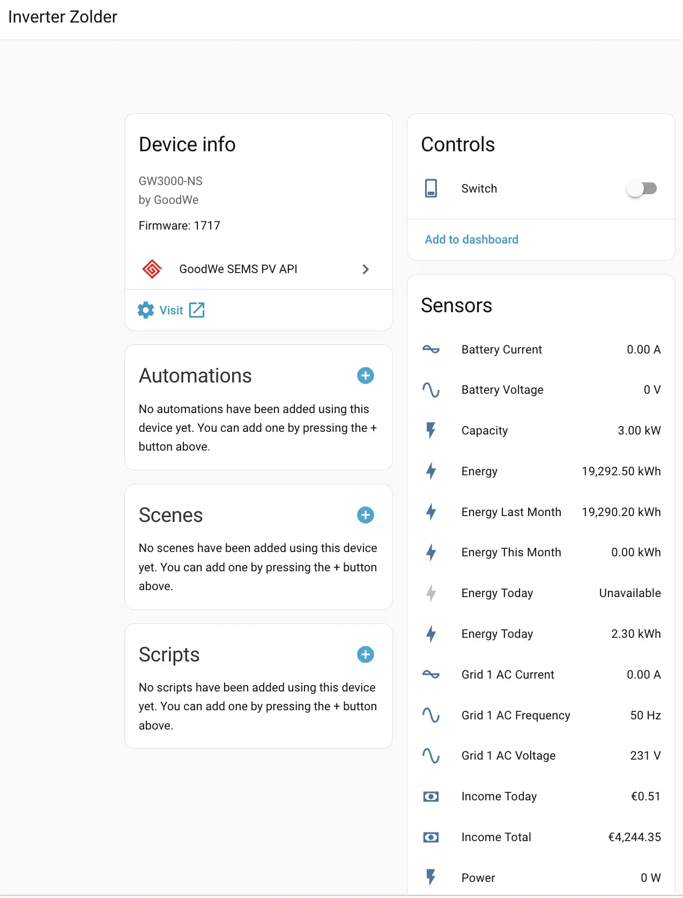
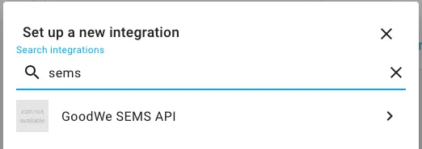
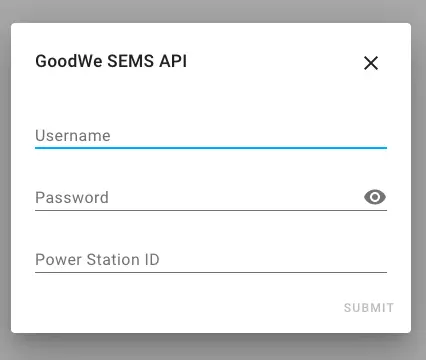

# Integração da API GoodWe SEMS para Home Assistant

[![Paypal-shield]](https://www.paypal.com/donate?business=9NWEEX4P6998J&currency_code=EUR)
<a href="https://www.buymeacoffee.com/TimSoethout" target="_blank"></a>

Integração no Home Assistant para receber dados da API SEMS da GoodWe.

## Setup

### Método mais fácil de instação - via HACS

[](https://github.com/custom-components/hacs)

A estrutura de pastas deste repositório é compatível com [HACS](https://hacs.xyz) e está incluido por pré-definição em HACS.

Instalar HACS via: https://hacs.xyz/docs/installation/manual.
Após isso pesquisar por "SEMS" na tab de integrações (abaixo de 'Community'). Clicar em `HACS` > `Integrations` > `Explore and Download Repositories` > pesquisar por `SEMS` > clicar no resultado > `Download`.

### Setup Manual

Crude sensor for Home Assistant that scrapes from GoodWe SEMS portal. Copy all the files in `custom_components/sems/` to `custom_components/sems/` your Home Assistant config dir.

## Configurar a integração

O ID da Planta é necessário para o correto funcionamento da API, sendo que pode ser obtido após login no SEMS portal:
https://www.semsportal.com

Após o inicio de sessão, o ID pode ser visto no URL, por exemplo:
https://semsportal.com/PowerStation/PowerStatusSnMin/12345678-1234-1234-1234-123456789012

Neste exemplo o ID da Planta é: 12345678-1234-1234-1234-123456789012

No HomeAssistant, ir a `Configuration` > `Integrations` ('Configuração' > 'Integrações') e clicar em `Add Integration` ('Adicionar Integração'). Pesquisar por `GoodWe SEMS API`

Preencher a informação pedida e de imeadiato deve aparecer a lista de inversores.

Nota de que as alterações ao 'configuraion.yaml' não são mais necessárias e podem ser removidas.

### Recomendado: utilizar a conta de visitante como login para esta integração 

Cria através da app ofocial da SEMS ou através do portal web:
Login em www.semsportal.com, aceder a https://semsportal.com/powerstation/stationInfonew. Criar nova conta de visitante. 
Iniciar sessção na conta de visitante uma vez para aceitar os EULA. O componente fica assim pronto para ser usado.

### Templates Extra (opcional) para aceder á informação como se fossem sensores
Substituir `$NAME` com o intity ID do inversor.
```yaml
  - platform: template
    sensors:
      pv_temperature:
        value_template: '{{ states.sensor.inverter_$NAME.attributes.tempperature }}'
        unit_of_measurement: 'C'
        friendly_name: "PV Temperature"
      pv_eday:
        value_template: '{{ states.sensor.inverter_$NAME.attributes.eday }}'
        unit_of_measurement: 'kWh'
        friendly_name: "PV energy day"
      pv_etotal:
        value_template: '{{ states.sensor.inverter_$NAME.attributes.etotal }}'
        unit_of_measurement: 'kWh'
        friendly_name: "PV energy total"
      pv_iday:
        value_template: '{{ states.sensor.inverter_$NAME.attributes.iday }}'
        unit_of_measurement: '€'
        friendly_name: "PV income day"
      pv_itotal:
        value_template: '{{ states.sensor.inverter_$NAME.attributes.itotal }}'
        unit_of_measurement: '€'
        friendly_name: "PV income total"
      pv_excess:
        value_template: '{{ states.sensor.inverter_$NAME.attributes.pmeter }}'
        unit_of_measurement: 'W'
        friendly_name: "PV spare"
      # battery soc
      pv_soc:
        value_template: '{{ states.sensor.inverter_$NAME.attributes.soc }}'
        unit_of_measurement: '%'
        friendly_name: "Battery power"
```

Nota que `states.sensor.inverter_$NAME.state` mostra a potência de saída em `W`. 

## Screenies







## Debug info

Adicionar na ultima linha em `configuration.yaml`, na parte relevante de `logger`:

```yaml
logger:
  default: info
  logs:
    custom_components.sems: debug
```

## Notas

* Por vezes a API SEMS é um pouco lenta, portanto podem apareceer mensagem de erro de timeout nos logs como `[ERROR]`. No entanto o componente deve continuar a funcionar normalmente e tentar atualizar de novo no próximo minuto.

## Development setup

- Setup HA development environment using https://developers.home-assistant.io/docs/development_environment
- clone this repo in config directory:
  - `cd core/config`
  - `git clone git@github.com:TimSoethout/goodwe-sems-home-assistant.git`
- go to terminal in remote VSCode environment
- `cd core/config/custom_components`
- `ln -s ../goodwe-sems-home-assistant/custom_components/sems sems`

## Credits

Inspirado por e em https://github.com/Sprk-nl/goodwe_sems_portal_scraper e https://github.com/bouwew/sems2mqtt .
Também suportado por contribuidores generosos e vários membros uteis da comunidade.

[Paypal-shield]: https://img.shields.io/badge/donate-paypal-blue.svg?style=flat-square&colorA=273133&colorB=b008bb "Paypal"
